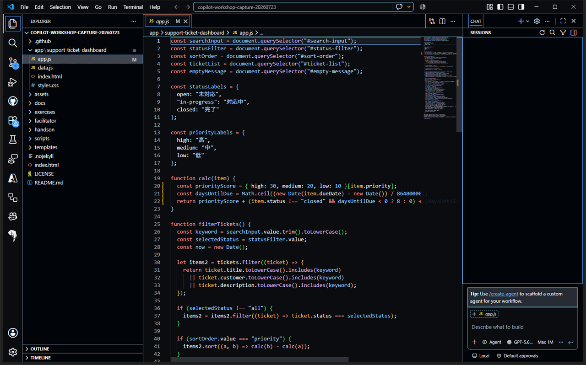

# Session 1: GitHub Copilot利用の最初の一歩

**Time: 5 min**

## ゴール

Copilot Chatへ対象、目的、制約、出力形式を渡し、回答をそのまま信じず確認する流れを体験します。

## 1. 利用できる状態を確認する

1. エディターまたはCodespacesでリポジトリ全体を開きます。
2. Copilot Chatを開き、入力欄が使えることを確認します。
3. `app/support-ticket-dashboard/app.js`を開きます。



## 2. 最初のプロンプトを送る

Chat Viewで次のプロンプトを送ります。

```text
#file:app/support-ticket-dashboard/app.js

このファイルがSupport Ticket Dashboardで受け持つ役割を、GitHub Copilotを初めて使う開発者向けに1〜2文で説明してください。
続けて、次の3項目に分けて説明してください。

1. 画面から受け取る入力
2. 主な処理
3. 画面へ返す出力

「主な処理」では、このファイル内でfunctionとして定義されている関数を見つけ、
関数ごとに名前と役割を1〜2文で説明してください。
それぞれが何を受け取り、何を処理し、結果をどこで使うかを含めてください。
各説明には、根拠となる実際の変数名、関数名、またはDOM要素のIDを含めてください。
まだコードは変更しないでください。
```

## 3. 回答を実ファイルで確認する

回答に出てきた関数名や画面要素を、`app.js`で検索します。

- [ ] ファイル全体の役割が、実際の処理と一致している
- [ ] 回答に挙がった関数が実際に存在する
- [ ] 各関数の入力、処理、結果の利用先が実際のコードと一致している
- [ ] 検索欄、ステータス、並び順に対応する変数とDOM要素を確認した
- [ ] 回答に存在しないファイルや関数が混ざっていない

> [!TIP]
> 良い依頼は、対象、目的、制約、期待する出力形式が明確です。回答が広すぎる場合は、ファイルや関数をさらに絞ります。

## この章の確認

- [ ] 対象ファイルと説明してほしい観点を指定して質問できた
- [ ] 回答に挙がった主な関数を`app.js`で見つけた
- [ ] 関数ごとの役割を実際のコードと照合できた
