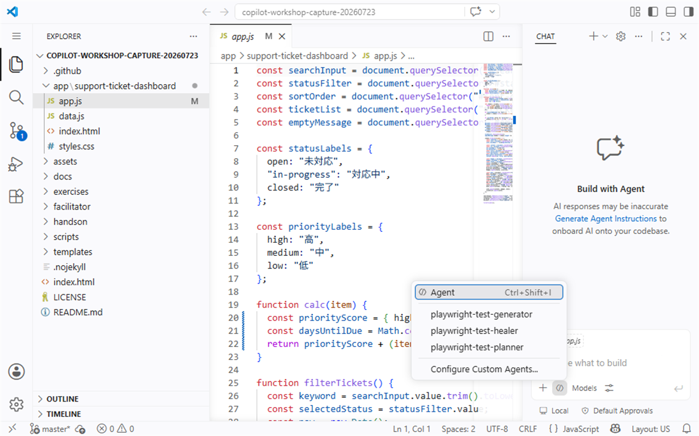

# Session 5: 振り返りと次の一歩

**Time: 5 min**

## 60分で実践した流れ

| 場面 | Copilotに任せたこと | 人が確認したこと |
| --- | --- | --- |
| 最初の一歩 | 対象ファイルの概要説明 | ファイルと関数が実在するか |
| コード理解 | 処理の流れの整理 | 説明とコードが一致するか |
| 仕様・文書 | 差分候補とメモの下書き | 事実と未確定事項が分かれているか |
| リファクタリング | 小さな変更計画と編集 | 差分と変更前後の動作 |

## 明日からの使い方を決める

次の中から、明日試す作業を1つ選びます。

- [ ] 読み慣れていない関数を選択して`/explain`する
- [ ] 対象ファイルを指定して処理の流れを表にする
- [ ] 仕様書と実装の差分候補を整理する
- [ ] 変更前の確認手順を作ってから小さくリファクタリングする

## 次の学習

今日使った依頼をそのまま持ち帰る場合は、[プロンプト例（Session 1〜5）](../templates/prompt-examples.md)を参照してください。S1-S5で使った依頼をまとめています。

## 完了条件

- [ ] Copilotに任せる作業と人が確認する作業を説明できる
- [ ] 明日試す小さな活用場面を決めた
- [ ] 60分版の60分を完了した
